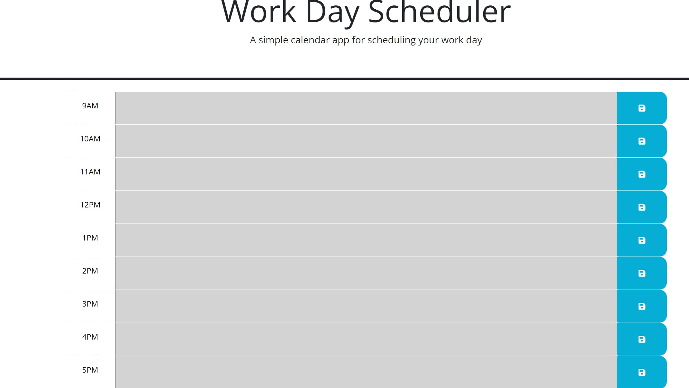

# Work Day Scheduler-jatan

## Description

The Work Day Scheduler is a web-based application that helps you manage and organize your work day tasks, The app dynamically updates the color-coded time blocks based on the current time to indicate past, present, and future tasks.

## Demo

## Features

- Display of time blocks from 9am to 5pm.
- Color-coded time blocks to visually represent past, present, and future tasks.
- Save button for each time block to store task descriptions.
- Local storage integration to persist task descriptions even after page reload.

## Technologies Used

- HTML5
- CSS3 (Bootstrap 5.1.3)
- JavaScript (jQuery)
- Day.js
- Font Awesome
- Google Fonts

## Usage

1. Upon opening the app you'll see the current date and time displayed at the top.
2. The time blocks for each hour from 9am to 5pm will be displayed.
3. Each time block has a text area where you can enter and save task descriptions.
4. Click the save button (icon) next to the text area to save the task description.
5. The color of the time block will indicate whether it's in the past, present, or future.
6. The app will update the colors every minute to reflect the current time.

## credits
if its not between 9am-5pm, trust me the colors were working :thumbsup: